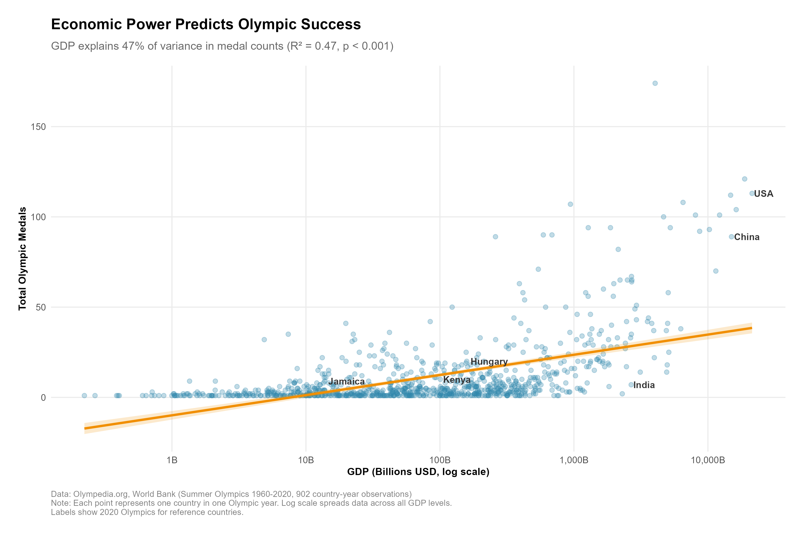

# Olympic Medals and Economic Development Analysis

An exploration of the relationship between national economic strength (GDP) and Summer Olympic medal performance across countries over time.

## Overview

This project investigates how a country's economic resources correlate with their success at the Summer Olympics. By combining historical Olympic medal data with historical GDP statistics, we aim to understand whether wealthier nations win more medals, and how this relationship has evolved over different Olympic years. The analysis includes visualizations of medal distributions, GDP comparisons, and statistical modeling to determine the strength of the relationship between a country's wealth and its Summer Olympics Performance

**Key Research Questions:**
- How strongly does GDP predict Olympic medal counts?
- Has this relationship strengthened or weakened over time?
- Which countries achieve the most medals relative to their economic resources?
- What factors beyond GDP drive Olympic success?


### Interesting Insight (Optional)



**Economic power predicts Olympic success—but it's not the whole story.** While GDP explains 47% of variance in medal counts, our efficiency analysis reveals dramatic differences: **Hungary achieves 1.33 medals per billion GDP, making them 162 times more efficient than India** despite India's economy being 12 times larger. This suggests that strategic investment in athletics matters more than raw economic size.

Countries like Kenya, Jamaica, and Cuba prove that smart sports programs can compete with economic superpowers. Meanwhile, wealthy nations like India and the USA demonstrate that money alone doesn't guarantee _proportional_ Olympic success.

## Key Findings

1. **GDP is a strong but imperfect predictor** - Economic resources explain 47.2% of variance in medal counts (p < 0.001)

2. **Efficiency varies dramatically** - Hungary (1.33 medals/$B GDP) vs India (0.008 medals/$B GDP) shows a 162x difference in efficiency

3. **Smaller economies are more efficient** - Negative correlation (r = -0.12) between GDP size and medals per dollar

4. **The relationship has strengthened over time** - Correlation increased from ~0.60 in early Olympics to 0.87 in 2020 (except 1980 Moscow boycott anomaly)

5. **Only Hungary appears in both top 10 lists** - Top total medals AND top efficiency, proving smart investment competes with economic power

## Data Sources and Acknowledgements

**Olympic Medal Data**
- Source: Olympedia.org (https://www.olympedia.org/statistics/medal/country)
- Collection Date: November 23, 2024
- Coverage: Summer Olympics 1960-2020

**GDP Data**
- Source: World Bank Open Data
- Indicator: NY.GDP.MKTP.CD (GDP, current US$)
- URL: https://data.worldbank.org/indicator/NY.GDP.MKTP.CD
- Download Date: November 23, 2024
- File: `API_NY.GDP.MKTP.CD_DS2_en_csv_v2_269001.csv`
- Coverage: 1960-2023 (filtered to Olympic years)

## Current Plan

The analysis will proceed through several phases:

1. **Data Wrangling**: Import and tidy both Summer Olympic Medal data over time and GDP by country data over time
2. **Data Preparation**: Merge Olympic medal counts with GDP data by country and year
3. **Exploratory Analysis**: Examine distributions, trends over time, and outliers
4. **Statistical Modeling**: Quantify the relationship between GDP and medal counts using regression analysis
5. **Comparative Analysis**: Explore medals per capita and medals per GDP dollar to identify high-performing nations
6. **Visualization**: Create graphics showing the relationship between economic power and Olympic performance

## Repo Structure

```
.
├── data/
│   ├── raw/                              # Original data files
│   │   ├── olympics_medals_summer.csv    # Raw Olympic medal data
│   │   ├── olympics_medals_summer_clean.csv
│   │   ├── API_NY.GDP.MKTP.CD_DS2_en_csv_v2_269001.csv  # World Bank GDP data
│   │   └── gdp_clean.csv
│   └── processed/                        # Analysis-ready datasets
│       ├── olympics_medals_standardized.csv
│       ├── olympics_gdp_merged.csv       # !!Main analysis file!!
│       ├── olympics_gdp_with_residuals.csv
│       └── olympics_efficiency.csv
├── scripts/
│   ├── 01_scrape_summer_olympics_data.R
│   ├── 02_clean_olympics_medals_summer_data.R
│   ├── 03_clean_gdp_data.R
│   ├── 04_merge_gdp_olympics.R
│   ├── 05_standardize_olympics_data.R
│   ├── 06_exploratory_analysis.R         # EDA and initial visualizations
│   ├── 07_regression_analysis.R          # Linear modeling
│   ├── 08_efficiency_analysis.R          # Medals per GDP calculations
│   └── 09_final_visualizations.R         # Publication-quality plots
├── figures/
│   └── final/                            # Polished visualizations for report
│       ├── 01_gdp_medals_relationship.png
│       ├── 02_efficiency_champions.png
│       ├── 03_efficiency_paradox.png
│       └── ...
├── analysis/                             # Analysis findings documentation
│   ├── eda_findings.md
│   ├── regression_findings.md
│   └── efficiency_findings.md
├── analysis_report.qmd                   # Final Quarto analysis report (TODO)
└── README.md
```


## Authors

### Arul Santoshi — Penn State Student
- **Email:** ajs10266@psu.edu  
- **GitHub:** Arul-Santoshi  

### Kyle Spaulding — Penn State Student
- **Email:** kbs6178@psu.edu  
- **GitHub:** spauldingk  

### Krish Chavan — Penn State Student
- **Email:** ksc5629@psu.edu  
- **GitHub:** KrishPSU  

---
Feel free to contact us with any questions either via email or GitHub.

 
